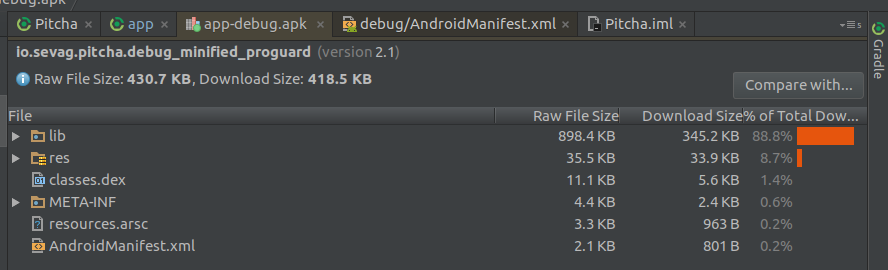
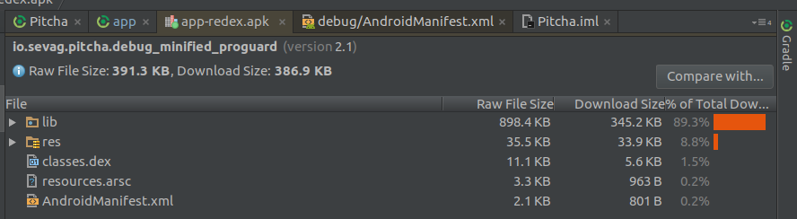

# Pitcha 

 

### Description

This is a pitch detector for Android. It uses the McLeod Pitch Method, adapted from [TarsosDSP](https://github.com/JorenSix/TarsosDSP).

The MPM is implemented in both Java and C (via NDK). This is toggleable in the UI:

#### Benchmarks (DDMS)

Java:

NDK:

#### APK minification

Proguard:

Proguard + [Redex](https://github.com/facebook/redex):

### Install

The repository is an Android Studio project. To install the app, download it from the store links (outdated code), or build from this repo.

There are also apks in this repo:

* [signed apk](app/app-release.apk)
* [redex unsigned apk](app/app-redex.apk)
* [redex signed apk](app/app-redex-signed.apk)
